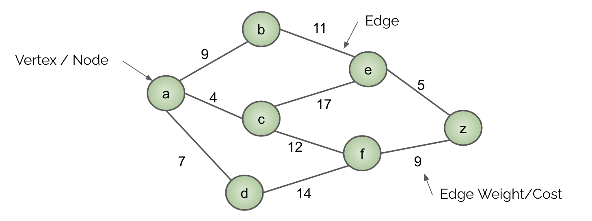
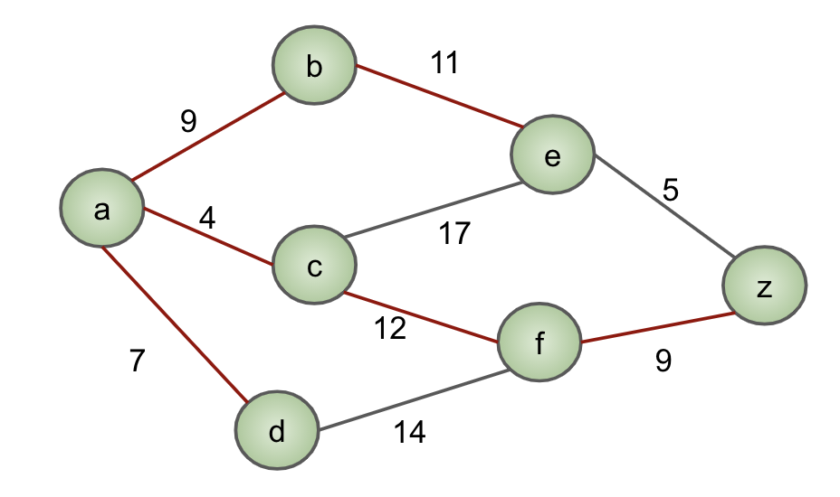
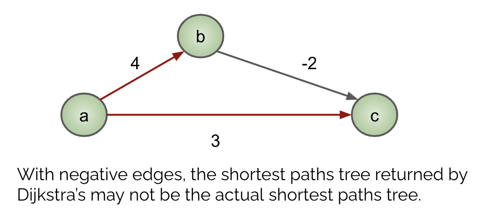
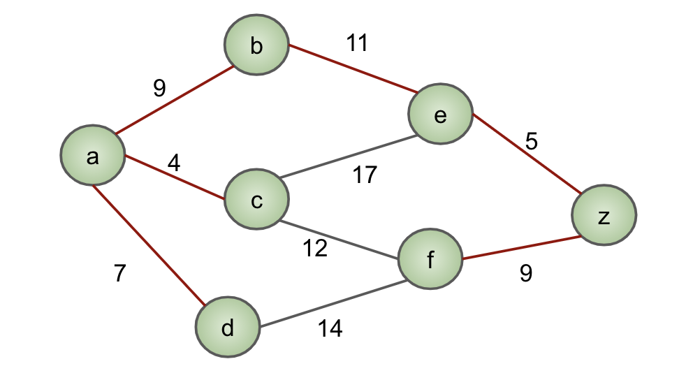
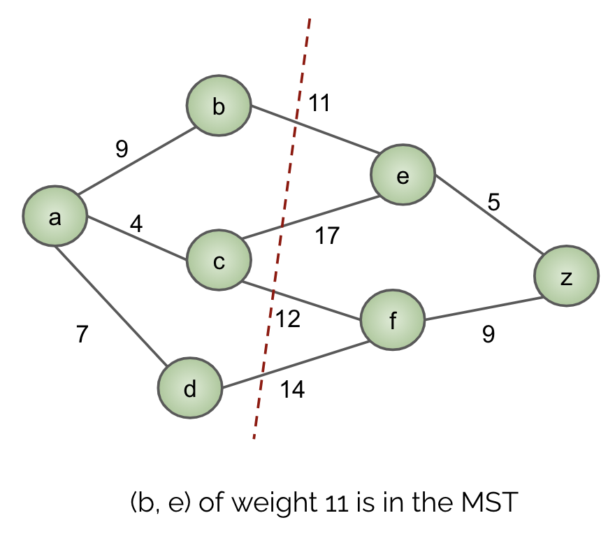

# Graphs

[Dijkstra's Algorithm](dijkstra's-algorithm) <br/>
[A* Algorithm](A*-algorithm) <br/>
[Prim's Algorithm](Prim's-algorithm) <br/>
[Kruskal's Algorithm](Kruskal's-algorithm)



Graphs are abstract data types that model relationships between different elements. **Directed** graphs have edges that are arrows, thus conveying a direction of the connection between two vertices. **Undirected** graphs have edges that don't have a direction, thus conveying a two-way relationship. The graph shown above is an undirected graph. A graph is **connected** when there is a set of edges (a **path**) connecting every pair of vertices. 

### Trees
Trees are undirected, acyclic, and connected graphs. They have |V| - 1 edges, where |V| is the number of vertices (any more would create a cycle and any less would result in an unconnected graph). As a result, there is a unique path between any two vertices. 

## Shortest Paths Tree
Given a graph _G_ and a vertex _s_, the shortest paths tree of _G_ starting at _s_ is a tree where the distance from _s_ to every other vertex is minimized. The shortest paths tree of a graph is specific to the starting vertex, since it includes the edges that would minimize the distance from the root vertex to all other vertices in the graph. Therefore, if we chose a different starting vertex, we would create a different shortest paths tree. Since every vertex in _G_ is included in its shortest paths trees, the shortest paths tree **spans** the graph. Below colored in red are the edges included in the shortest paths tree of the graph rooted at vertex _a_. 



### Dijkstra's Algorithm 
Dijksta's is an algorithm used to find the shortest paths tree of a graph _G_ given a starting vertex _s_. It uses a minimum priority queue data structure to keep track of each vertex and its current known distance to the source. At the beginning of the algorithm, every vertex is infinitely far from the source, since the graph has not been explored. 

At each step of the algorithm, we visit the next closest vertex _u_ to the source vertex _s_ and _relax_ its edges, meaning we update the distance to _s_ of unvisited vertices adjacent to _u_. Below is the pseudocode of Dijkstra's. The `fringe` is the minimum priority queue. The `edgeTo` array keeps track of the edges used in the shortest paths tree so far (`edgeTo[v]` is the vertex adjacent to _v_ such that the edge to _v_ is used in the path from the _s_ to _v_ in the shortest paths tree). The `distTo` array keeps track of the distances of the vertices from the source (`distTo[v]` is the distance from _s_ to _v_.)
```
visited = {} \\ keep track of set of visited vertices
fringe.add(source, 0) \\ the source has priority 0, since it has a distance of 0 to itself
for all other vertices v:
  fringe.add(v, infinity)
  
while fringe is not empty:
  v = fringe.removeSmallest()
  for each edge v --> u with weight w where u is not in visited:
    visited.add(u)    
    if distTo[v] + w < distTo[u]: \\ a shorter path to u is found
      distTo[u] = distTo[v] + w
      edgeTo[u] = v
      fringe.changePriority(u, distTo[u])
```

#### Negative Edges 
Notice that once a vertex is removed from the fringe, it is never readded. As a result, once a vertex is removed, its distance from the source is never updated again. This means that Dijkstra's assumes the distance from the source to a vertex cannot decrease as more edges are added. Each step of the algorithm we remove the vertex that is closest to the source with the assumption that any other path we find to that vertex would be greater that what is currently found. This assumption may fail with the presence of negative edges. To illustrate, consider the example below. When forming the shortest paths tree from vertex _a_ with Dijkstra's algorithm, we determine that the shortest path from a to c is a-->c with a distance of 3, but we can see that the actual shortest path from a to c is a-->b-->c with a distance of 2. 



#### Runtime
When deriving the runtime of algorithms in general, we can break it down into its different operations and data structures. Dijkstra's algorithm consists of adding to, removing from, and changing priorities in a heap. 

_Add/Removing:_

Each vertex is added to the priority queue once and also removed once. Therefore there are V add operations and V remove operations, where V is the number of vertices. <br/>
A single add takes O(logV), so adding V times takes `O(VlogV)`. <br/>
A single remove takes O(logV), so removing V times takes `O(VlogV)`.

_Change Priority:_

Change priority operations can occur at most E times, since this is the number of edges in the graph. In the worst case, every time we relax an edge, we could  update the shortest distance to a vertex. <br/>
A single change priority takes O(logV), so changing priority at most E times takes `O(ElogV)`.

_Overall Runtime:_

To get the overall runtime, we add the runtime for each set of operations, which is `O(VlogV) + O(VlogV) + O(ElogV) = O((V + E)logV)`. <br/>
We often see the runtime written as just `O(ElogV)` when we assume that there are more edges than vertices, which is usually the case in connected graphs. 

#### Examples
1. [Prof. Hug's walkthrough](https://docs.google.com/presentation/d/1_bw2z1ggUkquPdhl7gwdVBoTaoJmaZdpkV6MoAgxlJc/pub?start=false&loop=false&delayms=3000&slide=id.g771336078_0_180)
2. [CSM worksheet example](https://docs.google.com/presentation/d/12qe3WMUFkPFrMOwyP9GlA9ZWgEWhecPcSBDD7KR4rcg/edit?usp=sharing)

### A* Algorithm 
A* is a more efficent alternative to Dijkstra's when the goal is to find the shortest path between a specific pair of vertices. Unlike Dijkstra's, it does not have to explore every single vertex in the graph and form the entire shortest paths tree. It instead uses **heuristics**, which are estimations of the distance from a vertex _s_ to the target vertex _t_, in order to find the shortest path from the source to the target. A* terminates when it visits vertex _t_, and it guarantees to have found the shortest path from the specified _s_ to _t_. However, since estimations aren't perfect, any other paths explored to other vertices _w_ may not actually be the shortest path to that _w_ if _w_ is not along the path _s_ to _t_. 

The mechanics of A* are the same as Dijkstra's, except the priorities of the vertices in the fringe includes its heuristic value. As a result, it has the same runtime as Dijkstra's and it can also fail with negative edges. 

#### Heuristics
A heuristic of a vertex _v_ is an estimation of the distance from _v_ to the target vertex. Heuristics must be:
- **admissible**: the heuristic of a vertex is an underestimate of its true distance to the target vertex
- **consistent**: the difference between heuristics of two vertices is at most the true distance between them 
  - `h(A) - h(B) ≤ dist(A, B)`

#### Examples
1. [Prof. Hug's walkthrough](https://docs.google.com/presentation/d/177bRUTdCa60fjExdr9eO04NHm0MRfPtCzvEup1iMccM/edit#slide=id.g771336078_0_180)
2. [CSM worksheet example](https://docs.google.com/presentation/d/1-PYEdu6ZXX7rnxB5hM8WXeA5N6EKgmPiDkNTarkLhsA/edit?usp=sharing)

## Minimum Spanning Tree
A spanning tree of a graph _G_ is a tree whose vertices are the vertices in _G_. A minimum spanning tree is a spanning tree whose sum of the edge weights is minimized. Unlike shortest paths trees, we do not have to specify a start vertex for MSTs, since we are considering the total cost of the edges and not minimizing the distance from one vertex to the others. 

The following red edges form the minimum spanning tree of this graph.



### Prim's Algorithm 
Prim's algorithm is a way to find a minimum spanning tree of a graph. It works mechanically like Dijkstra's, except the priority of a vertex is now the distance to the forming MST (we are considering a single edge weight here) instead of the distance to a source. Since MSTs do not have a notion of a source vertex, we can arbitrarily choose a vertex from which to start executing Prim's. Choosing different start vertices could potentially result in different MSTs, as there could be different ways to included edges such that the sum of their edge weights is minimized. The uniqueness of MSTs is discussed more in detail in the Cut Property section. 

Here is the pseudocode of Prim's. As you can see, it's almost identical to Dijkstra's. 
```
\\ initialzed the same way as Dijkstra's

while fringe is not empty:
  v = fringe.removeSmallest()
  for each edge v --> u with weight w where u is not in visited:
    visited.add(u)    
    if w < distTo[u]: \\ different from Dijkstra's
      distTo[u] = w \\ different from Dijkstra's
      edgeTo[u] = v
      fringe.changePriority(u, distTo[u])
```

#### Cut Property 
A **cut** of a graph is the set of edges that separates the vertices of the graph in two.



The **cut property** states that the lightest edge across a cut is in _some_ MST. Since MSTs must span the entire graph, the two halves produced by the cut must be connected somehow. The cheapest way to do so would be to use the lightest edge. The reason why it is included in _some_ MST and not _all_ MSTs is that edge weights do not have to be unique. If there are multiple edges in the cut with the smallest weight, any one of them must be included when forming the MST. Expanding upon this, **if edge weights are unique, then the MST of the graph is also unique**. Note that the converse is not true. If the MST of a graph is unique, it does not guarantee unique edge weights (consider the simple graph a--b--c, where the MST is unique no matter what the edge weights of a--b and b--c are). 

Prim's algorithm uses the cut property to create the MST. Namely, the cut considered in Prim's is the set of edges separating the graph into vertices already in the forming MST and those that are not. The algorithm then picks the lightest edge across that cut. 

#### Examples
1. [Prof. Hug's walkthrough](https://docs.google.com/presentation/d/1NFLbVeCuhhaZAM1z3s9zIYGGnhT4M4PWwAc-TLmCJjc/edit#slide=id.g9a60b2f52_0_0)
2. [CSM worksheet example](https://docs.google.com/presentation/d/1fhQAlA94zKMbf-vBcTL-MZY8B1-l9ERV1qfCZcNS764/edit?usp=sharing)

### Kruskal's Algorithm 
Kruskal's is another algorithm for finding minimum spanning trees. It sorts the edges from lightest to heaviest. Then it adds edges in order into the MST as long as adding that edge does not create a cycle. To detect whether or not a cycle is created with the addition of an edge, we use the disjoint sets data structure to keep track of which vertices are connected. When considering adding the edge _(u, v)_, we first ask `isConnected(u, v)`? If so, we know that adding the edge _(u, v)_ would create a cycle, since there is already a path between _u_ and _v_ that does not use this edge. If they are not connected, we add _(u, v)_ to the MST and `union(u, v)` to indicate that now _u_ and _v_ are connected. 

The runtime of Kruskal's is `O(ElogE)`, since it is dominated by the time it takes to sort the edges. As a reminder, the runtime of disjoint sets data structure operations are amoritized constant. 

#### Examples
1. [Prof. Hug's walkthrough](https://docs.google.com/presentation/d/1RhRSYs9Jbc335P24p7vR-6PLXZUl-1EmeDtqieL9ad8/edit#slide=id.g9a60b2f52_0_0)
2. [CSM worksheet example](https://docs.google.com/presentation/d/12aazu4ER6vFjASgaRmWzZzt04jbzB_BizdXLmK9cqTw/edit?usp=sharing)
