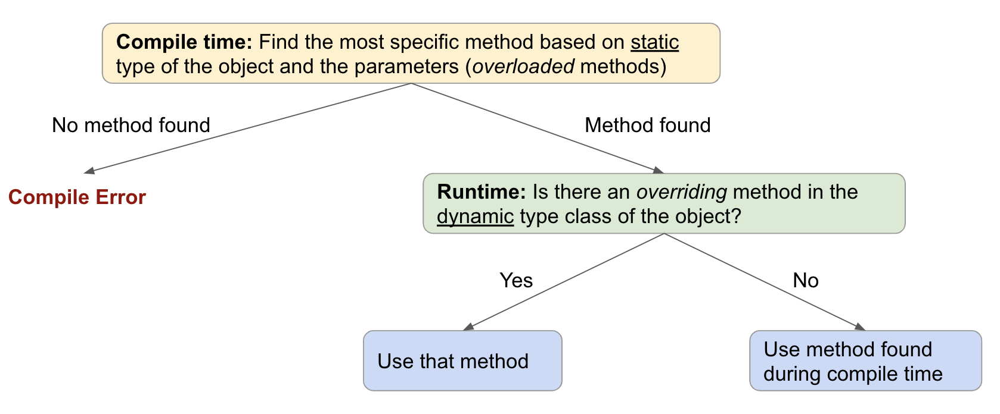

# Object Oriented Programming 

## Static vs. Dynamic Type
The static type is used during compile time, while the dynamic type is used during runtime. In the example below, `Dog` is the static type of `donner`, and `Husky` is the dynamic type. `Husky` is both the static and dynamic type for `dasher`. 
```
Dog donner = new Husky();
Husky dasher = new Husky();
```
The dynamic type must be the same class or a subclass of the static type. In other words, \<dynamic type\> is a \<static type\> (e.g. A Husky is a Dog). 

## Overriding vs. Overloading 
```
class Dog {
  public void bark();
  
  public void play();
}

class Husky extends Dog {
  @Override
  public void bark();
  
  public void play(Dog friend);
  
  public void play(Husky friend);
}
```
_Overloaded_ methods are methods in the same class that have the same name but different parameters. For example, `play(Dog friend)` and `play(Husky friend)` in the `Husky` class are overloaded methods. These methods are looked up during compile time and the method parameters are matched using static types. Using `dasher.play(donner)` as an example, the static type of `donner` is `Dog`, so we find the method `play(Dog friend)` in the `Husky` class during compile time. A more detailed and continued walkthrough is in the Dynamic Method Selection section.    

A method in the subclass _overrides_ a method in the superclass if has the same signature (same method name and parameters with the same static types and order). An `@Override` tag is often used above the method in the child class that overrides the method in the parent class. The `bark()` method in `Husky` overrides the `bark()` method in `Dog`. Overriden methods are looked up during the runtime of the program using the dynamic type of the object calling the method. 

## Casting
Casting tricks the compiler to use a different static type for an object. A cast is successful if there simply exists a parent-child relationship between the cast and the static type of the object. During runtime, we check if this parent-child relationship between the cast and the dynamic type actually makes sense. For example, consider the following:
```
Dog douglas = new Dog();
```
The cast `(Husky) douglas` is valid, because there is a parent-child relationship between `Husky` (the cast) and `Dog` (the static type of the object). This passes compile time. During runtime, however, this code would error. The dynamic type `Dog` is not valid with the casted static type `Husky`. In other words, the code `Husky douglas = new Dog()` does not make sense, as a `Dog` is not a `Husky`. 

An upcast is when we cast a child type to a parent type, and a downcast is when we cast a parent type to a child type. 

## Dynamic Method Selection
In general, we can use this flow chart when executing dymanic method selection. 


Now let's run through an example.
```
dasher.play(donner);
```
During compile time, we look at the static types. The static type of `dasher` is `Husky`, so we look in the `Husky` class and see that there are multiple `play` methods (i.e. it is an overloaded method). The static type of `donner` is `Dog`, so the most specific method found during compile time is `play(Dog friend)`. 

Next, during runtime, we use the dynamic type of `dasher`, which is also `Husky`. Since there is no overriding method, we will use the method found during compile time, which is `play(Dog friend)`.

You may have noticed that it seems like `play(Husky friend)` may be a better fit. But be careful! Overloaded methods are not considered during runtime. 
