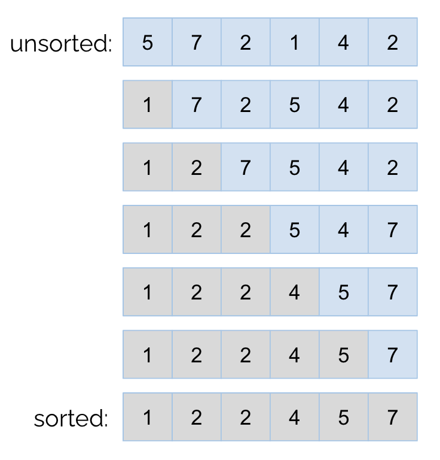
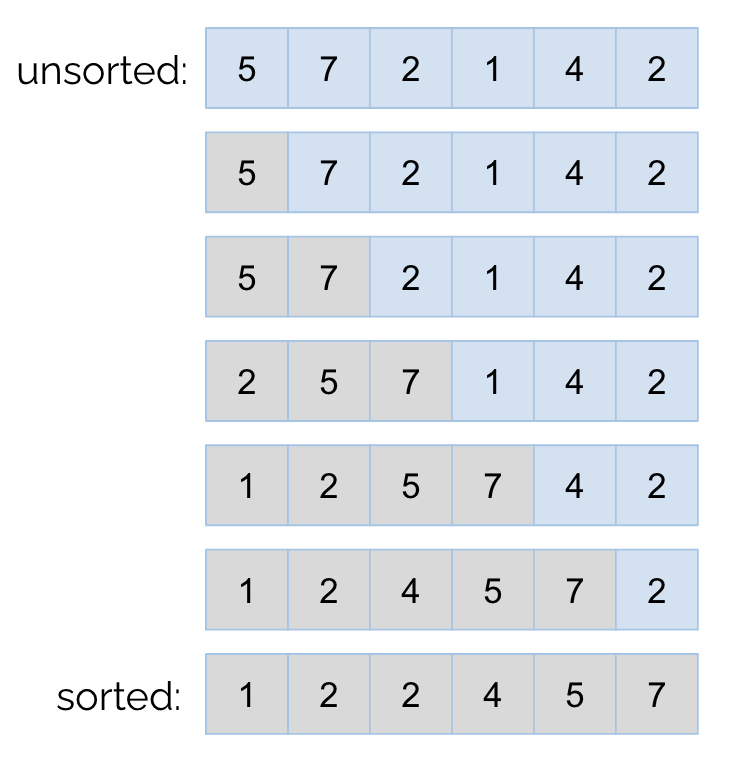
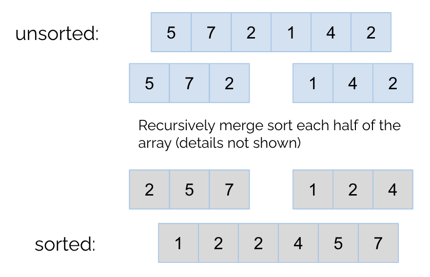
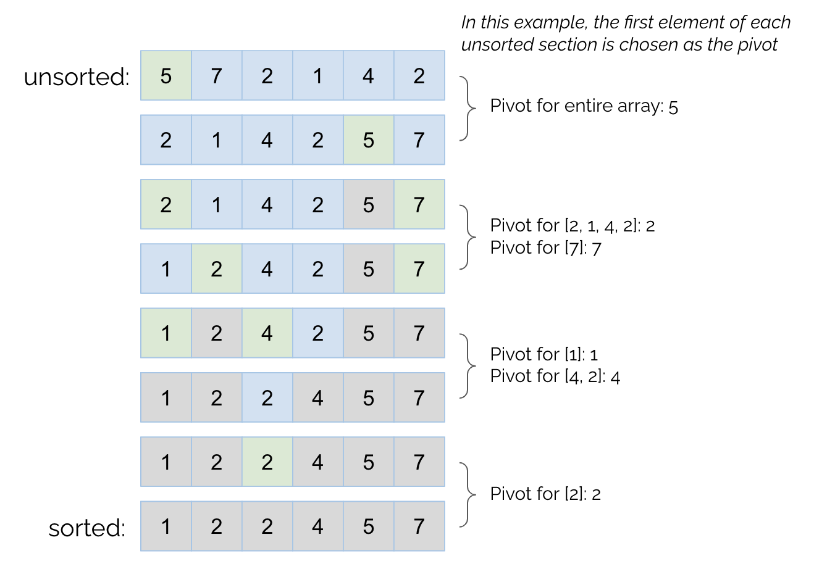
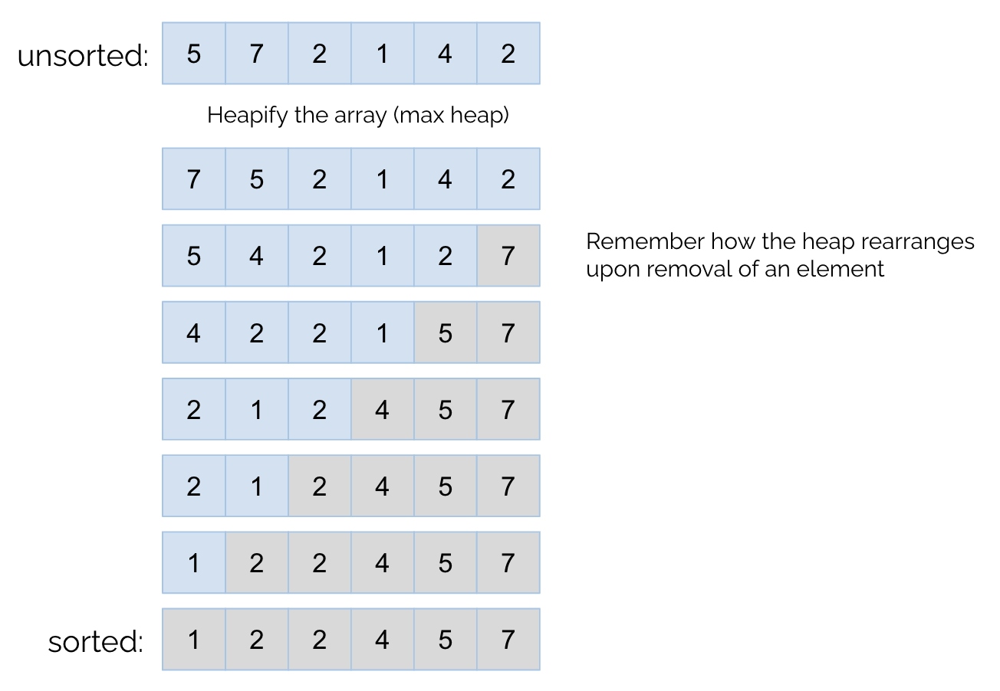
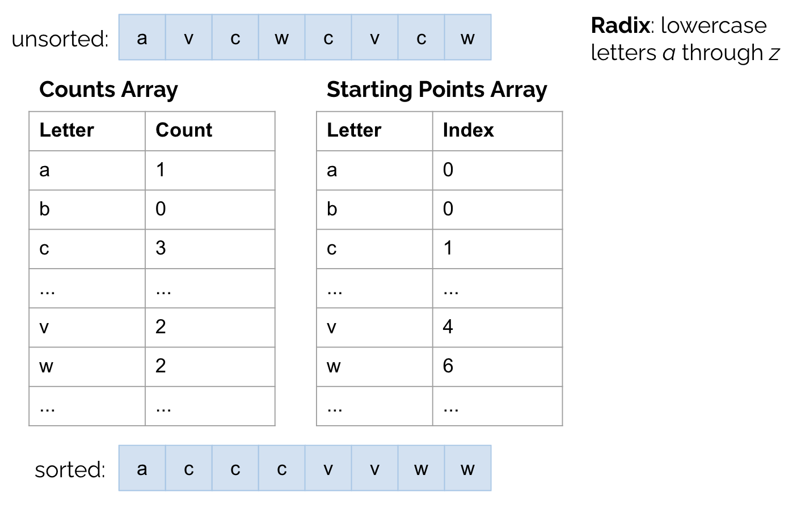
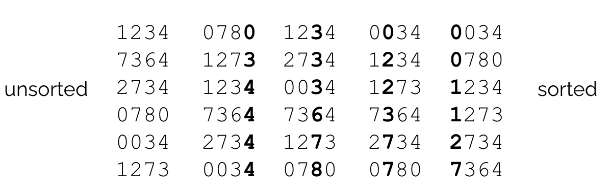
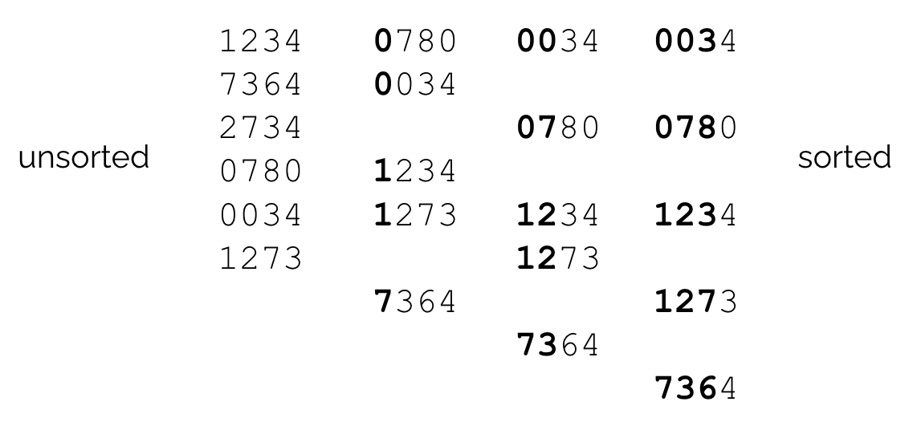

# Sorting

Before walking through all the different sorting algorithms taught in this class, let's define **stability**. A sort is **stable** if objects that are viewed as equal by the sort are in the same position relative to each other before and after the sort. Let's explore stability with an example.

| Name          | Favorite Restaurant |
| ------------- | ------------------- |
| Alice         | Thai Basil          |
| Bob           | Sweetheart Cafe     |
| Carol         | Poke Parlor         |
| Dan           | Thai Basil          |
| Eve           | Kimchi Garden       |

If we sorted the table above by favorite restaurant alphabetically, the sort views (Alice, Thai Basil) and (Dan, Thai Basil) as equal since they have the same favorite restaurant. The sort is then _stable_ if Alice is still listed before Dan and unstable otherwise. Below is the result of a stable sort. 

| Name          | Favorite Restaurant |
| ------------- | ------------------- |
| Eve           | Kimchi Garden       |
| Carol         | Poke Parlor         |
| Bob           | Sweetheart Cafe     |
| Alice         | Thai Basil          |
| Dan           | Thai Basil          |


## Comparison Sorts

Comparison sorts are the sorting algorithms that involve directly comparing the elements being sorted with each other to determine their ordering. As a result, the efficiency of comparison sorts are limited by the number of comparisons necessary to order all the elements.

### Selection Sort

Selection sort consists of repeatedly selecting the minimum element in the unsorted portion of the array. That minimum element is then placed at the end of the sorted portion of the array. As shown in the example below, the front of the array contains the sorted (gray) elements, and the next element to be placed in order is the minimum element out of the unsorted (blue) portion of the array. The first minimum selected is 1, and it swaps positions with 5 (the first element in the unsorted portion of the array). This process continues until the entire array is sorted.



#### Runtime
The entire unsorted portion of the array is scanned each time to find the minimum. Given an array of length _N_, since the number of unsorted elements decrease by 1 each time, the cost of scanning the elements is _N + (N - 1) + (N - 2) + ... + 3 + 2 + 1 = &Theta;(N<sup>2</sup>)_. Swapping two elements in array take constant time. 

The best case and worst case runtimes for selection sort are both _&Theta;(N<sup>2</sup>)_, because scanning the entire unsorted portion of the array each time is necessary for picking out the minimum element. 

#### Stability
Stability for selection sort depends on how the minimum element is picked out each time. In the case that multiple elements tie as the minimum element, selection sort is stable if the first minimum is picked to be placed in order. It is unstable otherwise.

### Insertion Sort

Insertion sort consists of swapping each element with elements in front of it until it is in its sorted position ("inserting" elements in order). While an element _a_ is less than the element _b_ in front of it, _a_ swaps with _b_.



#### Runtime

The best case runtime is when the array is already sorted, since no swaps need to be made. Since we iterate through the array and perform no swaps, the best case runtime is _&Theta;(N)_.

The worst case runtime is when the array is reversed. If the goal is to sort the array so that it is `[1, 2, 3, 4, 5]`, the worst case runtime is achieved when the unsorted version of the array is `[5, 4, 3, 2, 1]`. This requires the maximum number of swaps, as each element must be swapped to the beginning of the array resulting in the cost _1 + 2 + 3 + ... + (N - 2) + (N - 1) + N = &Theta;(N<sup>2</sup>)_. 

#### Stability

Insertion sort is stable. Elements swap only until the element in front of it is less than or equal, so the relative ordering of equal elements remain the same after insertion sort is complete. 

### Merge Sort

Merge sort consists of breaking down the array in half, recursively sorting each half, then merging the two sorted arrays together to result in the overall sorted array. 



#### Runtime

Below is the recursion tree for merge sort. The work done per node is linear, since it takes _&Theta;(N)_ to merge together two arrays of length _N/2_.
```
        N            level 0 work: N
    /       \
  N/2       N/2      level 1 work: 2 * N/2 = N
  /  \      /  \
N/4  N/4  N/4  N/4.  level 2 work: 4 * N/4 = N
       ...
```
There are _logN_ levels, and the work per level is _N_, so the overall runtime of merge sort is _&Theta;(NlogN)_. Feel free to review the [asymptotics guide](https://github.com/Cindyzhang977/cs61b-teaching/blob/main/asymptotics.md) if you are confused about these calculations.

#### Stability

Merge sort is stable. When merging elements that are equal, the element in the left half (which appears before the elements in the right half in the original unsorted array) is placed in the sorted array first.

### Quick Sort

Quick sort involves first selecting an element _p_ as a pivot and then placing the other elements such that everything to the left of _p_ is less than or equal to _p_ and everything to the right of _p_ is greater than or equal to _p_. Like merge sort, the elements left of _p_ is recursively sorted using quicksort and so is the elements right of _p_. In the example below, the first element of each unsorted section of the array is chosen as the pivot, but the pivot can be chosen in other ways (chosen at random, choose the last element, etc.).



#### Tony Hoare Partitioning

Hoare Partitioning is a way to efficiently perform in-place quicksort so that we do not need to use an additional array to help us move elements to either side of the pivot. It uses two pointers: a left pointer _L_ that starts at the beginning of the array and traverses towards the end of the array and a right pointer _R_ that starts at the end of the array and traverses towards the front of the array. When _L_ finds an element greater than or equal to the pivot and _R_ finds an element less than or equal to the pivot, those two elements are swapped and the pointers move on to the next element. Once the pointers cross each other, we know that the entire array has been pivoted correctly. 

[Prof. Hug's Walkthrough](https://docs.google.com/presentation/d/1DOnWS59PJOa-LaBfttPRseIpwLGefZkn450TMSSUiQY/pub?start=false&loop=false&delayms=3000&slide=id.g463de7561_042)

#### Runtime

The best case runtime of quick sort is when the pivots are chosen such that roughly an equal number of elements are on either side of the pivot. This effectively divides the array in half so that there are _logN_ levels in the recursion tree and _N_ work at each level to pivot the elements. As a result, the best case runtime analysis is the same as that of merge sort, and the best case runtime of quick sort is _&Theta;(NlogN)_.

The worst case runtime occurs when the pivots are chosen poorly so that all the elements are pivoted to one side each time. This results in a runtime of _&Theta;(N<sup>2</sup>)_. Although this is a poor runtime, the worst case is extremely rare so quick sort is still one of the fastest sorting algorithms on average. 

#### Stability

The stability of quick sort depends on how elements are partitioned to either side of the pivot. The sort is stable if the elements are kept in the same relative ordering as they are moved to either side of the pivot and unstable otherwise. Quick sort with Tony Hoare Partitioning is unstable. 

### Heap Sort

As the name suggests, heap sort puts all the elements into a heap (this is done by heapifying the array) and then removes them one by one to produce a sorted ordering. When sorting the elements in increasing order, a max heap is used. This is so that when the maximum element is removed, it is moved to the end of the array. As a result, the first part of the array functions as the max heap while the other part is the sorted array. 



#### Runtime

Heapification of _N_ elements takes _&Theta;(NlogN)_ time (this can be reduced to _&Theta;(N)_ using bottom-up heapification). A single remove operation takes _&Theta;(logN)_, so it takes _&Theta;(NlogN)_ time to remove every element from the heap. Therefore, the overall runtime of heap sort is _&Theta;(NlogN)_.

In the best case, where all the elements are the same, heap sort runs in _&Theta;(N)_.

#### Stability

Heap sort is unstable. The ordering of elements inside a heap is rather random. The max heap only maintains the invariant that every element is greater than its children, but the ordering of its children does not matter. 


## Counting/Radix Sorts
Counting (or radix) sorts don't use comparisons, so it can run faster than _&Theta;(NlogN)_. However, counting sorts can only be used if the elements have a **radix**, which is a fixed alphabet. For example, the radix of English words is the English alphabet, and the radix of integers are the digits 0 through 9. Objects can't be sorted with counting sorts, because there is no way to break them down into parts that serve as a radix. If we are sorting dogs, for example, it wouldn't make sense to try to break them down to an alphabet. 

### Counting Sort
Counting sort, as the name suggests, first counts the number of occurrences of each element. Note that since we have a finite radix, we know exactly how many unique elements there are (if we are sorting integers, we know the digits can only be 0 through 9). We store these counts in a _counts array_, which has size _R_, where _R_ is the size of the radix. Then we allocate a new array of size _N_, where _N_ is the length of the unsorted input array. Since we know exactly how many elements there are of each category, we can place them one by one into the sorted array. A _starting points array_ is used to keep track of the next index of each category in the sorted array. 

Let's walk through the example below, where we are sorting an array whose radix is the lowercase letters _a_ through _z_.
1. Construct the _counts array_. Allocate an array of size _R = 26_ and count the number of occurrences of each letter in the unsorted array.
2. Constuct the _starting points array_. Allocate an array of size _R = 26_ and store the index at which the next element of that letter should be placed. For example, _a_ is the first letter in alphabetical order so the _a_'s start at index 0 in the sorted array. Then there is 1 _a_ and 0 _b_'s, so we know that the _c_'s must start at index 1 in the sorted array. 
3. Allocate another array of size _N_ to contain the elements in sorted order. Iterate through the unsorted array to place elements in their right place in this new sorted array. 
  a. Each time an element is placed in the sorted array, the starting points array is updated. For example, after we place the first _c_ at index 1, we know that the next _c_ will be placed at index 2. Therefore we update the starting points array so that the index of _c_ is now 2. 



As we will see, LSD and MSD sort are in essence multiple iterations of counting sort. 

#### Runtime
Let _N_ be the size of the input array and _R_ be the size of the radix. We can derive the runtime by breaking the sort down into its different steps. 

- Create array of size N to hold sorted order: _&Theta;(N)_
- Create array of size R as the _counts array_: _&Theta;(R)_
- Create array of size R as the _starting points array_: _&Theta;(R)_
- Iterate through the input array to fill out _counts_ and _starting points_ arrays: _&Theta;(N)_
- Iterate through the input array to place elements at the correct indices in the sorted array, updating the _starting points array_ each time: _&Theta;(N)_

Adding up the runtimes from each step, we get that the overall runtime of counting sort is _&Theta;(N + R)_. 

#### Stability
Counting sort is stable. Because we iterate through the input array in order when placing the elements into the sorted array, equal elements are kept in the same order relative to each other. 

### Least Significant Digit (LSD) Sort
LSD sort uses counting sort to sort each digit starting from the _least_ significant digit. As shown in the example below, the numbers are first sorted by the ones' place, then by the tens' place, and so on. Notice that numbers are zero-padded to make them all the same length (34 becomes 0034).   



#### Runtime
Remember that a single iteration of counting sort takes _&Theta;(N + R)_. Let _W_ be the length of the longest element. Since there is one iteration of counting sort for every digit, there are _W_ iterations of counting sorts. The overall runtime of LSD is _&Theta;(W(N + R))_. 

#### Stability
LSD sort is stable. It is simply multiple iterations of counting sort. 

### Most Significant Digit (MSD) Sort
MSD sort is just like LSD sort except it sorts each digit starting from the _most_ significant digit. In addition, it separates elements into groups with the same prefix on each counting sort iteration. In the example below, after sorting by the most significant place, the elements are separated into groups that have the same most significant digit. Then MSD sort looks at each group separately as the sort continues. In the example below, when sorting by the next most significant digit, the numbers that begin with 0 are sorted against each other, the numbers that begin with 1 are sorted against each other, and so on. This is necessary, since the all numbers with the most significant digit of 0 is less than all numbers with the most significant digit of 1 (after all numbers have been zero-padded so that they are all the same length). The sort terminates when every element is in a group alone or when it has finished sorting by the least significant digit.   



#### Runtime
In the best case, every element has a different most significant digit, so only one iteration of counting sort is needed until every element has its own group. This results in a runtime of _&Theta;(N + R)_. (Convince yourself why LSD sort can't terminate early and must sort from the least significant digit all the way to the most significant digit.)

In the worst case, counting sort must be used to sort every digit, so if _W_ is the length of the longest word, _W_ iterations of counting sort are needed. This results in a runtime of _&Theta;(W(N + R))_. 

#### Stability
MSD sort is stable. It is simply multiple iterations of counting sort. 

## Summary

| Sort | Prof. Hug's Walkthrough | Best Case Runtime | Worst Case Runtime | Stable? |
| ---- | ----------------------- | ----------------- | ------------------ | ------- |
| Selection Sort | [Demo Link](https://docs.google.com/presentation/d/1p6g3r9BpwTARjUylA0V0yspP2temzHNJEJjCG41I4r0/edit#slide=id.g463de7561_042) | &Theta;(N<sup>2</sup>) | &Theta;(N<sup>2</sup>) | Depends |
| Insertion Sort | [Demo Link](https://docs.google.com/presentation/d/10b9aRqpGJu8pUk8OpfqUIEEm8ou-zmmC7b_BE5wgNg0/pub?start=false&loop=false&delayms=3000&slide=id.g463de7561_042) | &Theta;(N) | &Theta;(N<sup>2</sup>) | Yes |
| Merge Sort | [Demo Link](https://docs.google.com/presentation/d/1h-gS13kKWSKd_5gt2FPXLYigFY4jf5rBkNFl3qZzRRw/pub?start=false&loop=false&delayms=3000&slide=id.g463de7561_042) | &Theta;(NlogN) | &Theta;(NlogN) | Yes |
| Quicksort | [Demo Link](https://docs.google.com/presentation/d/1QjAs-zx1i0_XWlLqsKtexb-iueao9jNLkN-gW9QxAD0/edit#slide=id.g3655bd8207_0_26) | &Theta;(NlogN) | &Theta;(N<sup>2</sup>) | Depends |
| Heap Sort | [Demo Link](https://docs.google.com/presentation/d/1SzcQC48OB9agStD0dFRgccU-tyjD6m3esrSC-GLxmNc/edit#slide=id.g463de7561_042) | &Theta;(N) | &Theta;(NlogN) | No |
| Counting Sort | [Demo Link](https://docs.google.com/presentation/d/1vmVKHRSwb5WN1rHvktplbPGecHChxOwWa7ovRuiLzbA/edit) | &Theta;(N + R) | &Theta;(N + R) | Yes |
| LSD Sort | N/A | &Theta;(W(N + R)) | &Theta;(W(N + R)) | Yes |
| MSD Sort | N/A | &Theta;(N + R) | &Theta;(W(N + R)) | Yes |
